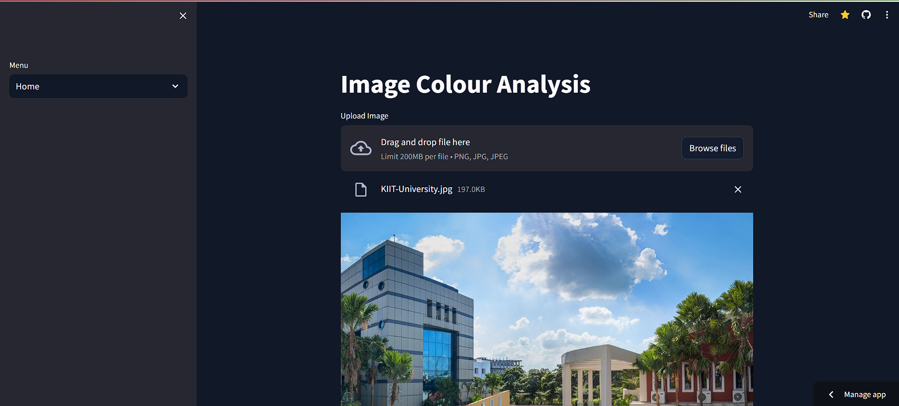
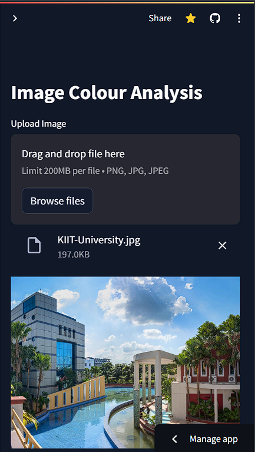

# Color Detection App

## Overview

Welcome to the Color Detection application! This app provides accurate distribution of colors of a image , provided by user.

## PC View - 


## Mobile View - 


## App View - 


## Getting Started

### Prerequisites

Make sure you have Python installed on your machine.

### Installation For Web

1. Clone the repository:

    ```bash
    git clone https://github.com/your-username/your-repository.git
    ```

2. Navigate to the project directory:

    ```bash
    cd your-repository
    ```

3. Install dependencies:

    ```bash
    pip install -r requirements.txt
    ```

## Running the Project

Open your terminal and run the following command:

```bash
streamlit run main.py


## Access the app locally through the following URL:

## Local URL: http://localhost:8501
```

### Running Software

1. Accessing the image:

Copy the relative path of the image, you are going to use
paste it on line no. 9

2. Running the app:

    ```bash
    python APP\color_detection.py
    ```


